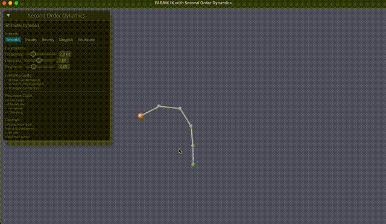

# ik-webgpu

FABRIK inverse kinematics with WebGPU rendering.

Paper: https://www.andreasaristidou.com/publications/papers/FABRIK.pdf

## Build

```
cargo build --release
```

## Run

```
cargo run --example animated_chain
```

## WASM

```
wasm-pack build --target web --out-dir docs/pkg
```

Serve `docs/` folder.

## Demo




https://ifeyz.github.io/ik-webgpu/
